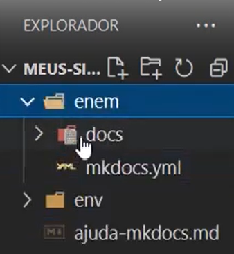
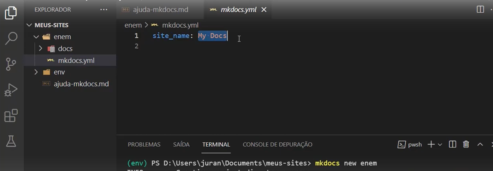
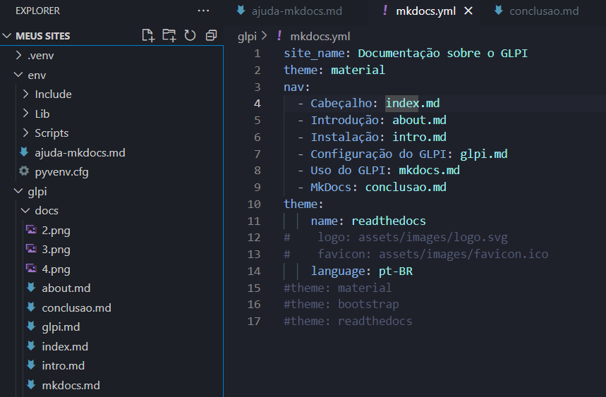
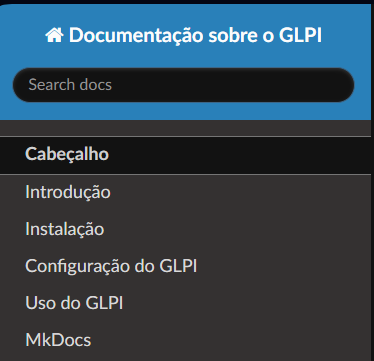

Começaremos agora um tutorial para instalar e utilizar o MkDocs utilizando VSCode e Python:

Passo 1: Preparativos
*Instalar Python:

 - Baixe e instale o Python 3.x a partir do site oficial do Python. Durante a instalação, certifique-se de marcar a opção "Add Python to PATH".

*Instalar Visual Studio Code (VSCode):

 - Baixe e instale o VSCode a partir do site oficial do Visual Studio Code.

*Instalar Git:

 - Baixe e instale o Git a partir do site oficial do Git.

 Passo 2: Configurar o Ambiente
*Abrir o VSCode:

 - Abra o VSCode.

  - Na opção de extensões, procure e instale a extensão Python
  

   - Na opção de arquivo abra os arquivos do explorer e crie uma pasta chamada 'meus sites'
*Abrir um Terminal no VSCode:
 - Na pasta que foi criada, abra o terminal

 - Vá para Terminal > New Terminal ou use o atalho Ctrl + Shift + (crase).

 Passo 3: Criar e Ativar um Ambiente Virtual
*Criar um Ambiente Virtual:

 - No terminal do VSCode, navegue até o diretório onde você deseja criar o seu projeto MkDocs e execute: python -m venv env

*Ativar o Ambiente Virtual:
 
 - No VSCode, abra a paleta de comandos (ctrl=shift+p) e procure pela opção "Python: Select Interpreter"

 Passo 4: Instalar o MkDocs

*Começando a instalação
 
 - Feche e abra o terminal novamente, depois digite o comando: pip3 install mkdocs mkdocs-material

 - Aguarde e verifique se a instalação foi bem sucedidia.

Passo 5: Criar um Novo Projeto MkDocs

*Criando um Projeto:
 - ainda no terminal do arquivo execute o comando: mkdocs new "nome da sua escolha"

 - neste arquivo haverá duas subpastas, na pasta "mkdocs.yml" é onde será arquitetado todo o seu projeto

 

 - dentro do espaço demostrado abaixo será feita a nomeação do projeto assim como todo o conteúdo a ser documentado.

 

 Passo 6: Executar o Servidor de Desenvolvimento

*Iniciar o Servidor de Desenvolvimento:

 - No terminal, dentro do diretório do projeto, execute: "mkdocs serve"

 - Isso iniciará um servidor de desenvolvimento e fornecerá um URL onde você pode visualizar seu site localmente.

*Visualizar o Site:

 - Abra um navegador e vá para o URL fornecido para visualizar o seu site MkDocs.

Passo 7: Editar o Conteúdo

*Abrir o Projeto no VSCode:

 - No VSCode, abra o diretório do projeto (my-project).

*Editar o index.md:

 - No painel do explorador do VSCode, abra o arquivo docs/index.md e comece a editar o conteúdo. As mudanças serão refletidas automaticamente no navegador se o servidor de desenvolvimento estiver em execução.

Passo 8: Personalizar o Site
*Editar o mkdocs.yml:

 - O arquivo mkdocs.yml é onde você pode configurar o tema, adicionar páginas, configurar navegação e outras opções.
 
 *Adicionar Páginas:

 - Crie novos arquivos .md no diretório docs e adicione referências a essas páginas no mkdocs.yml para incluí-las na navegação do site.
 
 

Passo 9: Construir o Site para Produção           
*Construir o Site:
 - Quando estiver pronto para publicar o site, execute: mkdocs build
 
 - Isso criará um diretório site contendo os arquivos HTML estáticos que podem ser hospedados em qualquer servidor web.

E pronto, seguindo estes passos o MkDocs esta pronto para uso de acordo com seu critério.