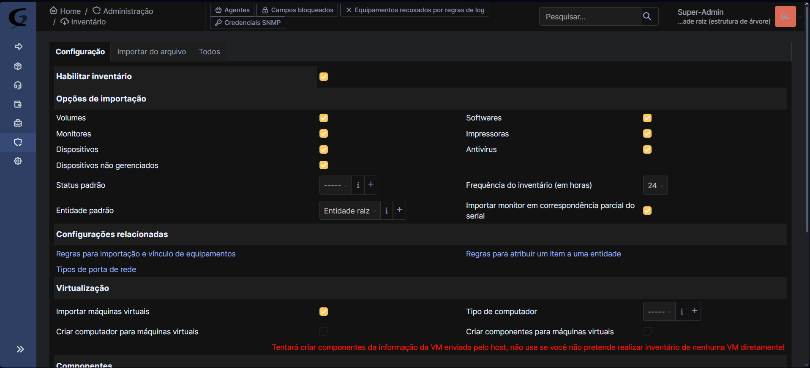

Nesta aba iremos mostrar como configurar e utilizar o seu glpi com o melhor desempenho:

-1. Configurar

*Configurações Gerais

 - Na opção de configuração geral, altere os "Limite de padrões decimais" para  2
 - Altere a opção "Tamanho da página para listas suspensas (paginação usando rolagem)" de 100 para 50
 
-2. Valores padrão

*Personalização 

 - Troque a opção de "Ordem de exibição de sobrenomes e nomes" para "Primeiro nome, sobrenome"
 - Na opção "Resultados a serem exibidos por página" coloque a quantidade baseada na que possui
 - Marque "Sim" na opção "Mostrar ID do GLPI"
 - Troque o "Formato da data" ´para "DD-MM-YYYY"
 - Na opção "Formato dos números" selecione a opção "1,234.56"
 - Altere a "Guia central padrão" para a "Visão pessoal"

*Assistência 
 - Marque sim na opção "Mostrar novos chamados na página inicial"

-3. Assistência 
 - Configure a opção "Limite dos agendamentos para planejamentos" de acordo com as horas trabalhadas
 - Remova o dia de domingo da opção "Dias de trabalho do planejamento" (a menos que a empresa funcione no domingo)

-4. Autenticação
Na opção de autênticação sera regitrado de acordo com  o método utilizado pela empresa

 - Se a empresa possui o AD com vários usuarios utilize o diretório LDAP
 - Se utilizam e-mail utilize a opção "Servidor de e-mail" e configure de acordo com as instruções do e-mail

-5. Entidade
 *Nomeando a entidade principal

  - Nomeie de acordo com o nome da empresa ou instituição sobre a qual compõem todos os equipamentos e pessoas a serem registradas

 - Caso haja uma ou mais filias da empresa sendo administradas é possivel alterar a entidade clicando no canto superior direito e selecionando a entidade a ser monitorada.

-6. Grupos 
*Separação de acordo com a função

 - Nesta aba é possivel nomear os diferentes grupos que executam diferentes funções dentro da empresa, alterando ,tambem, as funções que poderão exercer dentro da plataforma

-7. Usuário
*Criando usuários

 - Aqui é onde serão criados os respectivos usuários que irão utilizar a plataforma colocando nome,criando seu respectivo email e senha, a que entidade pertence, etc. 
 - Poderá ,também ,ser determinado que tipo de autorização cada usuário poderá ter, com cada nível contendo algumas funções que outros não terão.

-8. Perfis
*Perfil

 - Nesta aba estarão listados todos os pautorizações disponiveis

*Assistência

 - Altere e/ou determine as funções que poderão ser exercidas por cada um dos niveis de autorização

-9. Inventário 
 * Configurações de Inventário

  - Determine que tipos de itens poderão ser listados no inventário.

-10. Criar Chamado
*Criando um chamado

 - Crie um chamado que servirá como mensagem a ser recebida por todos os usuários,descrevendo do que se trata o chamado, determinando o nivel do assunto, o tipo de cartegoria, o nível de urgência, etc.

-11. Chamados 
 * Lista de chamados

  - Nesta aba serão listados todos os chamados realizados

* Respondendo Chamados

 - Cada usuário poderá responder ao chamado e tratar do assunto, que será recebido por quem emitiu o chamado

-12. Planejamento
*Criando um evento

 - Crie um evento de acordo com a data e a hora desejada, que poderá ser visualizado para os outros usuários

*Descrevendo o evento

 - Personalize o seu evento, determinando data e hora, descrevendo-o, selecionando o usuário a ser convidado, etc.

-13. Ativos

 *  Listando componentes do inventário

  - Nesta aba é possivel adicionar e visualizar todos os itens que compõem o inventário da empresa, cada item é separado por tipo,, para adicionar um item clique no item desejado a ser adicionado, clique no botão superior esquerdo "adicionar", descreva as caracteristicas exigidas e clique em salvar,

